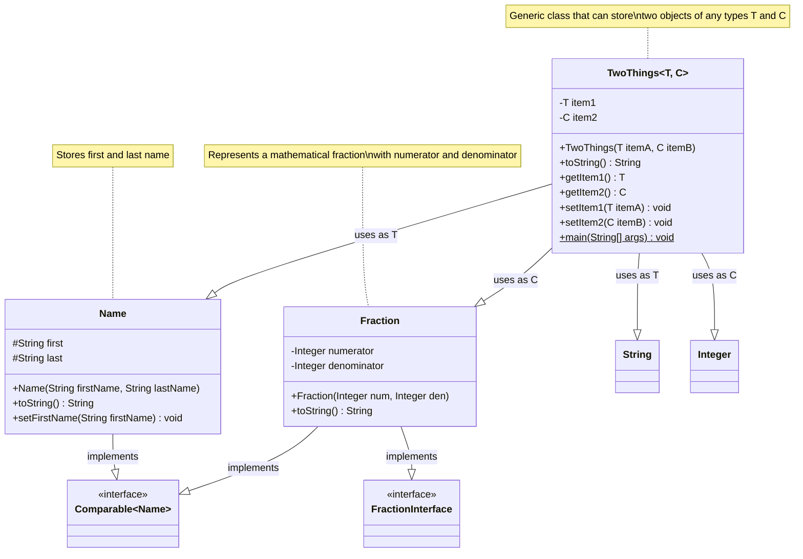
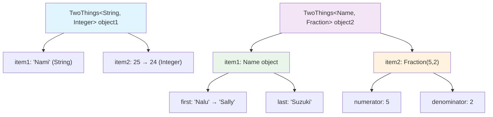

# TwoThings Class Diagram

This diagram shows the structure and relationships of objects in the TwoThings.java file.

## Object Instances in main()

## Legend
- **Private fields**: `-` (item1, item2, numerator, denominator)
- **Protected fields**: `#` (first, last)  
- **Public methods**: `+`
- **Static methods**: `$`
- **Generic types**: `~T, C~`
- **Interfaces**: `<<interface>>`